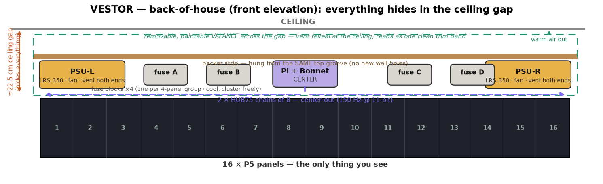

# VESTOR — BACK-OF-HOUSE (electronics siting + data topology)

Where every non-panel thing physically lives, how it's hidden, and the final data
topology. Backed by two cited research passes (HUB75 chain topology; back-of-wall
electronics hiding + PSU thermal). Companion: `../ELECTRICAL.md` (power),
`MOUNT_PARTS.md` (mount). Established 2026-07-02.

## The space: the ~22.5 cm ceiling gap is the service plenum

Behind the panels there is only ~1 cm — nothing hides there. The home for all the
hardware is the **~22.5 cm gap between the top of the panels and the ceiling**, running
the full 5.1 m. Everything mounts to a **continuous backer strip hung from the SAME top
wooden groove** (brackets drop a tongue into the groove and rise into the gap → **zero
new wall holes**; the groove is structural and the added load is ~2–3 kg). Optionally add
1–2 stud anchors for the strip itself as insurance — it's the only place dedicated anchors
would ever be worth it, and even that's optional given the groove's margin.

## What goes where (split by heat + the data topology)

| Item | Location in the gap | Why |
|---|---|---|
| **2× LRS-350-5 PSUs** (hot, fan) | **one near each END**, lying flat (horizontal), **both short-end vents clear**, ≥10–15 cm of air, not stacked over each other or a fuse block | Mean Well: fan is thermostatic (on ≥50 °C), airflow is **end-to-end**, and it derates above 50 °C ambient — so they must *breathe*. Ends stay coolest + shortest 5 V runs to each half. |
| **Raspberry Pi + Triple Bonnet** (cool) | **CENTER** | Feeds the two data chains outward (see topology). Runs cool → no thermal fuss; keep it off a PSU's exhaust. |
| **4× fuse blocks** (cool) | distributed, one per 4-panel group, on the strip | No heat → cluster freely wherever the DC trunks break out. |

**Thermal rule:** the valance (below) must make the gap behave like an **open shelf, not a
sealed box** — a gap sealed front+ends is a heat trap. If either end of the wall opens to a
cooler cavity/closet, dropping a PSU there (DC out into the gap) is the cleanest thermal answer.

## Hiding it: a breathing valance

Close the gap's front with a **removable, paintable valance** (MDF or 1× pine, full 5.1 m,
painted to match) standing off the wall — built as a **CHIMNEY, not a seal**: a **continuous vent
reveal at the ceiling (exhaust) + a low intake slot** so warm air convects out on its own
(optionally a quiet low-RPM exhaust fan). This is the highest-leverage permanent thermal decision —
retrofitting airflow into a closed 5 m gap is painful, and heat drives the top failure modes
(`../HARDENING.md`). It hides the row of silver boxes so the wall reads as **one clean trim band**,
and stays **removable** (magnets/cleat/few screws) for service — required, since a PSU can't be
permanently sealed (NEC) and terminals need re-torque access. Pro-standard for a floating wall with no rear clearance.

**EMI note:** run **wired Ethernet to the Pi and disable WiFi** — the wall is a broadband RF emitter
next to the Pi (Foundation-documented 2.4 GHz desense). Keep ribbons short and on a separate path
from the 60 A DC bus (cross at right angles). Details: `../HARDENING.md`.

## Wiring dress
- **10 AWG DC trunks** run along the strip, locked with adhesive/screw cable-tie mounts every
  ~15–20 cm; a **short vertical pigtail drop at each panel**.
- **Bundle like-with-like:** DC pigtails in one **spiral-wrap** loom (break out per panel), the
  16 **HUB75 ribbons** in a separate sleeved spine — power and data don't tangle. Keep ribbons
  gently arced (don't crease flat ribbon) and away from PSU exhaust.

## DATA TOPOLOGY — center-fed 2×8 (SUPERSEDES the single chain of 16)

**Locked: Pi in the CENTER, two chains of 8 in opposite directions** —
`--led-chain=8 --led-parallel=2 --led-pixel-mapper="U-mapper;Rotate:180"` (orientation tuned
once at bring-up). The Bonnet's two outputs land on the two **center panels (8 & 9)** → all
ribbons short. Chosen over the end-fed single chain of 16 because it wins on every axis that
matters for this content:

- **Color depth:** **11-bit (2048 levels) vs 9-bit (512)** — 4× finer gradients; banding shows
  worst in dark tones + slow fades, which *is* this board. (The big one.)
- **Signal integrity:** 16-on-a-chain = 32,768 px on one serial clock — 2× past hzeller's
  "already pushing limits," with ghosting on bright-text-over-dark as the documented failure.
  **8/chain is the safe sweet spot**; the active bonnet cleans the first hop but doesn't re-drive
  every panel. Center-feed also **shortens** every ribbon.
- **Refresh/camera:** **150 Hz vs 111 Hz** — margin for peripheral flicker (you stand close to a
  5 m wall), smoother swoop/split-flap motion, and cleaner phone video.
- **Cost:** the "snake" is a **built-in launch flag** (U-mapper/Rotate), not code you maintain;
  latency difference ~2 ms (imperceptible). Software already had the 2×8 snake logic.

**Implications:** revert `display/__init__.py` to `parallel=2, chain=8` + the U-mapper; the
"corner enclosure" CAD part becomes a **center enclosure**; the Pi's USB-C runs to center (its
GND bonds to the common V−). PSUs still split L/R (power is independent of data).

## Still to confirm on-site
- The **panel's power-connector position** (decides up-vs-down pigtail routing).
- Whether an end opens to a cooler cavity (better PSU home).
- Valance material/finish to match the room.
