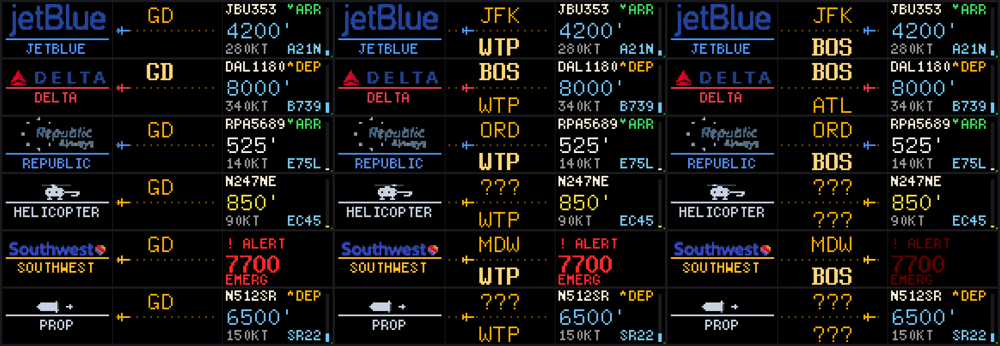

# VESTOR — The Single-Panel Flight Card (on-Pi, 64×32)
### "Departures for the sky" — the legendary Phase-0 flight display

This is the **on-Pi Python** implementation of the airline-branded flight scene
(the hardware sibling of the web sim's [`DESIGN.md` §5.1 / §5.1a](DESIGN.md)).
It runs on the real panel via `display/` + `scenes/`, driven by the hzeller
`rpi-rgb-led-matrix` binding. Built and confirmed live 2026-07-01.



*Offline pixel-accurate render (`tools/preview_card.py`) — 3 carriers ×
5 frames, left→right showing the split-flap flip-in progressing to settled.*

---

## 1. The layout — three horizontal bands + a livery rule

The 64×32 panel is zoned into disjoint horizontal bands, each owned by one scene
that clears and redraws only its own rows (the its-a-plane composition model).
Disjoint bands mean draw-order never matters and nothing smears.

```
 rows  0..11   AIRLINE LOGO      full-colour wordmark (scrolls if wider than 64)   scenes/airlinelogo.py
 row   12      LIVERY RULE       1px hairline in the airline's brand colour        scenes/airlinelogo.py
 rows 13..25   ROUTE             BOS ·· ✈ ·· JFK  — 8×13, split-flap flip-in       scenes/journey.py
 rows 26..31   TELEMETRY         callsign  +  rotating [alt | type | N/M]          scenes/flightdetails.py
```

Reading top-to-bottom is a boarding-pass hierarchy: **who** (logo) → **where**
(route) → **details** (callsign/altitude/type). The cycle between overhead
aircraft is driven headlessly by `scenes/planedetails.py` (a ~7 s dwell timer
that advances the index and re-arms the animations via `reset_scene()`).

---

## 2. Airline logos — the sim's assets, rendered on the Pi with Pillow

The web sim ships **64 full-colour wordmark PNGs** (`sim/logos/*.png`, RGBA, 64px
tall, up to ~750px wide) plus `sim/logos/manifest.json` with the ICAO→IATA map.
The Pi reuses those exact assets — a **single source of truth** — and renders
them **at runtime with Pillow** (`setup/logos.py`, `get_logo(iata)`), cached per
carrier so each logo is rasterised once:

1. Load `sim/logos/<IATA>.png`, resize to **12px tall** (LANCZOS) preserving
   aspect.
2. Flatten alpha against black (anti-aliased edges become naturally dimmer px).
3. **LED legibility lift** — raise each pixel's HSV *value* (`v**0.62`, floored
   at 0.50) while keeping hue. Many liveries are dark navy/black wordmarks
   (American, British Airways) — the worst case on a black HUB75 panel because
   blue is the dimmest subpixel *and* the driver's CIE1931 curve dims mids
   further. The lift makes them readable and lets the colourful mark (the AA
   eagle, the BA Speedmarque) pop; already-bright logos barely move.
4. Emit `[(x,y,r,g,b), …]` and blit with `canvas.SetPixel`, which the temporary
   Port-3 shim already offsets by +64 rows — so the logo code is
   **panel-lane-agnostic** and works unchanged on the eventual centre-fed wall.

Logos that fit in 64px are drawn static + centred; wider wordmarks **scroll as a
marquee** (this is what reveals the BA Speedmarque / the AA eagle). Unknown
carrier → the curated short name (or ICAO) in brand colour.

> **Dependencies, deliberately.** Pillow does the image work — no hand-rolled
> resampling — and is a declared runtime dep (`requirements.txt`), present on the
> Pi. We prefer public packages over bespoke code; the only custom pieces are
> Vestor-specific (layout, brand map, the LED lift). *(An earlier revision baked
> the logos offline into a packed-bytes `.pkl` to dodge a runtime Pillow dep —
> that was needless wheel-reinvention and was removed.)*

**Callsign → logo:** `UAL123` → ICAO `UAL` → IATA `UA` → `UA.png`, via
`setup/airlines.py` (a Python mirror of `sim/airlines.js`, kept in sync).

---

## 3. Colour language — a real aviation vocabulary, not arbitrary colour

Research (six parallel agents, 2026-07-01) converged on: dark background + a few
saturated accents, 1:1 bitmap fonts never scaled, and **avoid blue for small
text** (lowest photoreceptor sensitivity + dimmest HUB75 subpixel — so the
upstream blue callsign was the single worst colour choice and was dropped).

| Element        | Colour | Rationale |
|----------------|--------|-----------|
| Route codes    | **Solari amber** `#FFB000` | the classic split-flap departure-board look |
| Home airport   | warm bold `(255,214,120)` + `8×13B` | pops the local field (`JOURNEY_CODE_SELECTED`) |
| Callsign       | warm white `(250,240,215)` | legible, off-blue |
| Altitude       | **FR24 altitude ramp** | white→yellow→green→blue→indigo→violet by height |
| Aircraft type  | soft cyan | secondary, distinct from altitude |
| Livery rule + chase marker | **airline brand colour** | ties the whole card to the carrier |
| Climb / descent | green ▲ / red ▼ | vertical-speed at a glance |

---

## 4. The delight moments (motion, cheap at 20 fps on a Pi 4)

- **Split-flap flip-in** — on every new flight/index, each airport-code cell
  rolls through a glyph scramble, staggered left→right, then locks on target
  (`scenes/journey.py`, `FLAP_*`). The departure-board flourish.
- **Logo marquee** — wide wordmarks scroll slowly (`LOGO_SPEED`), wrapping
  seamlessly so the whole name (and livery marks) pass by.
- **Chase marker** — a brand-colour "aircraft" sweeps a dotted track from origin
  toward destination on a loop — reads instantly as *en route*.
- **Rotating telemetry** — the right field cycles altitude → type → N/M every
  ~3.5 s, keeping the panel dense without crowding 64px.
- **20 fps** — `setup/frames.py PERIOD=0.05` (up from upstream 10) for smooth
  scroll/flip. All data-cadence keyframes are expressed in `PER_SECOND`, so they
  stay correct at any frame period.

---

## 5. Files

| File | Role |
|------|------|
| `sim/logos/*.png` + `manifest.json` | the 64 wordmark assets (shared with the sim) |
| `setup/logos.py` | runtime Pillow logo renderer: load → resize → LED lift → cache |
| `setup/airlines.py` | ICAO→IATA map, brand colours + names, FR24 altitude ramp |
| `scenes/airlinelogo.py` | logo band + livery rule (NEW scene) |
| `scenes/journey.py` | route band: split-flap codes + chase marker (rewritten) |
| `scenes/flightdetails.py` | telemetry band: callsign + rotating field (rewritten) |
| `scenes/planedetails.py` | headless dwell/cycle controller (rewritten) |
| `utilities/overhead.py` | +`aircraft_code` field for the type readout |
| `display/__init__.py` | wires `AirlineLogoScene` into the mixin |
| `tools/preview_card.py` | offline pixel-accurate PNG preview (mocks `rgbmatrix` + a BDF renderer) |

### Reproduce / redeploy
```bash
# preview offline (Mac; needs Pillow)
python3 tools/preview_card.py          # -> tools/preview_card.png
# ship the assets + code to the Pi + restart (see RUNBOOK). Pillow must be
# installed in the Pi venv (it is): env/bin/pip install Pillow
rsync -az sim/logos setup scenes utilities root@vestor:/home/pi/vestor/
ssh root@vestor 'systemctl restart vestor'
```

To tune a specific carrier's legibility, adjust `LIFT_*` in `setup/logos.py`
and restart — no offline bake step.

> ⚠️ **Temp Port-3 shim still active.** The live panel is on bonnet **Port 3**,
> so the Pi's `display/__init__.py` runs `parallel=3` + a `+64`-row `SetPixel`/
> `DrawText`/`DrawLine` shim. The logo pipeline rides that shim (it uses
> `SetPixel`), so it needs no lane maths. **Revert before the centre-fed wall.**
> See [RUNBOOK.md](../RUNBOOK.md) "Phase 0" and [BUILD_LOG.md](../BUILD_LOG.md).
