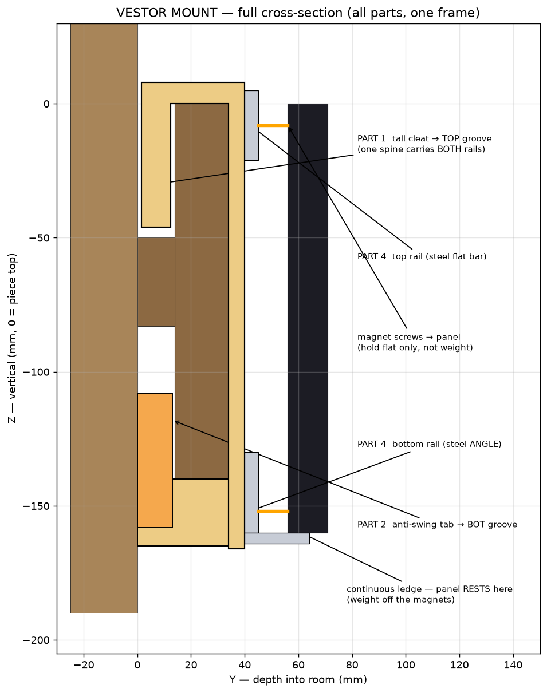
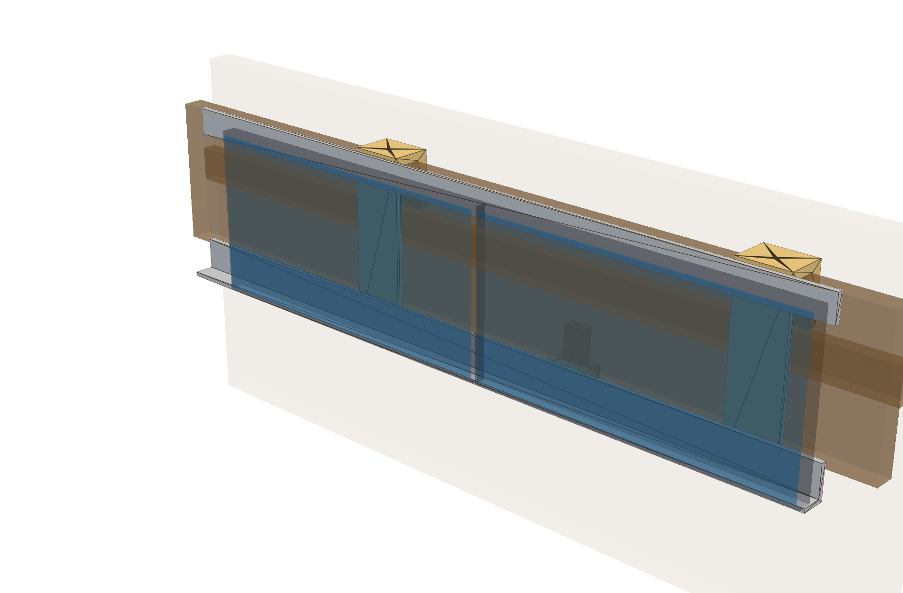
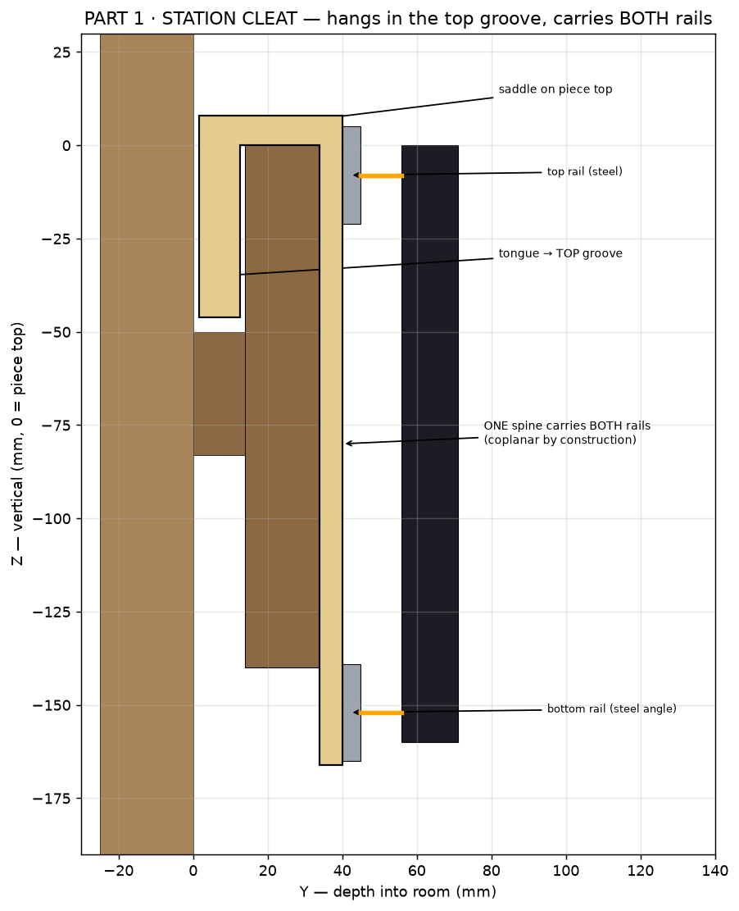
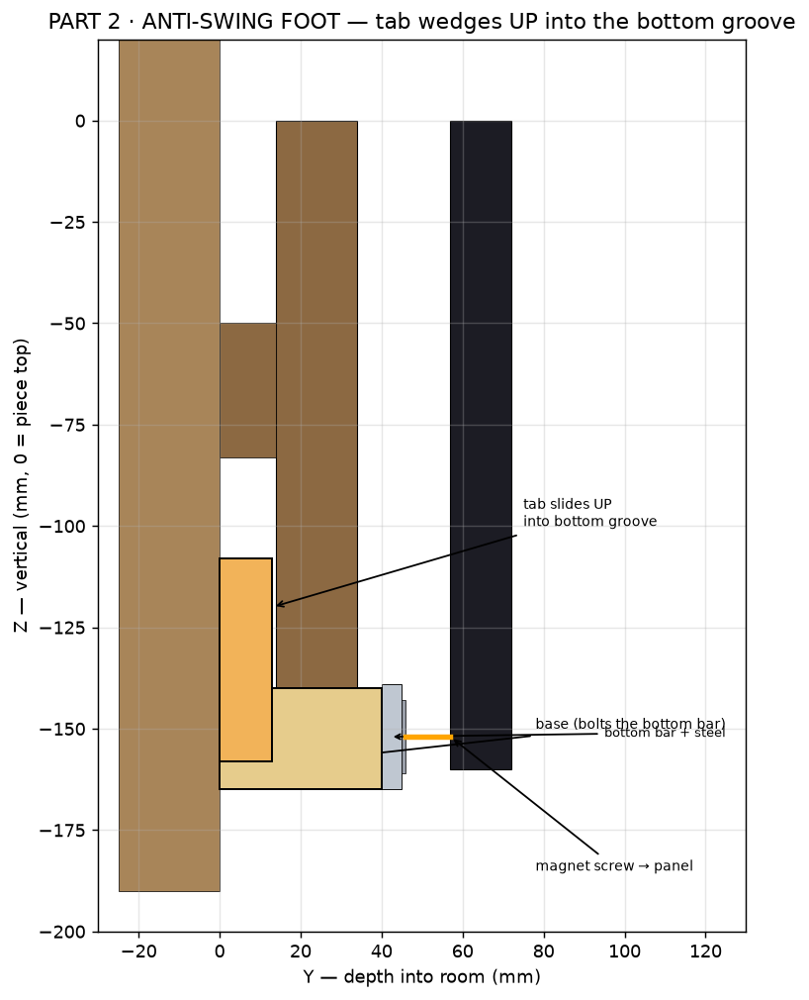
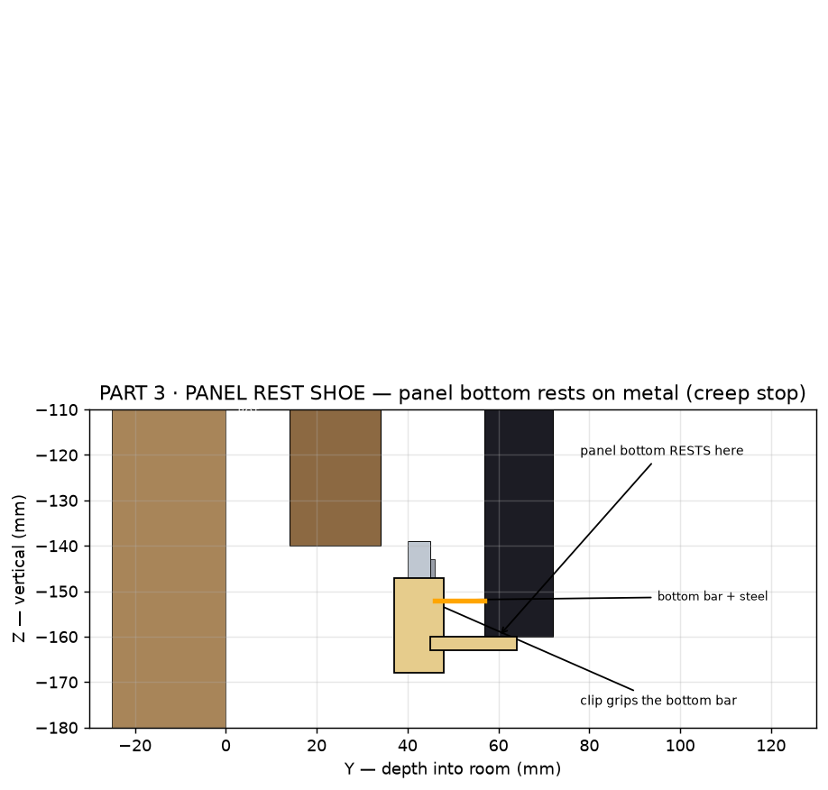
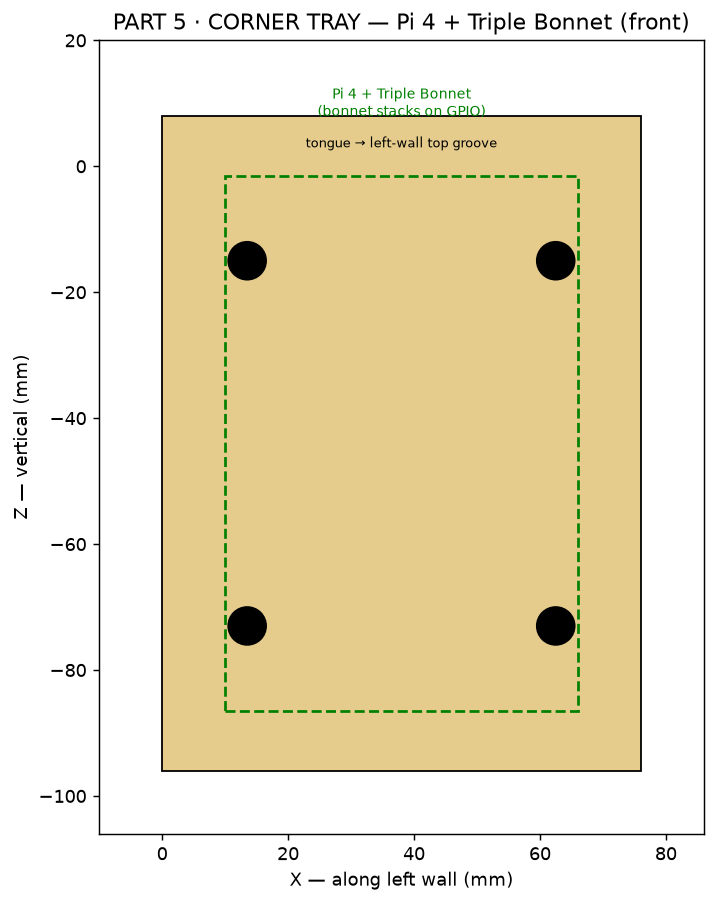
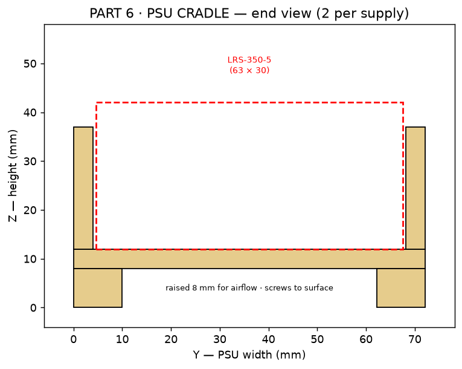

# VESTOR MOUNT — PARTS MANIFEST (buildable)

> **⚠️ REVISED 2026-07-02 by the manufacturing-strategy research → see `MANUFACTURING_PLAN.md`
> (authoritative).** Key changes since this manifest was first written: rails are now
> **steel** (flat bar top + **angle** bottom), not aluminium + a glued strip; the cleat is
> now a **tall C-bracket carrying BOTH rails** (coplanarity datum); the **16 rest-shoes are
> deleted** (the bottom angle's leg is a continuous ledge); rails are center-anchored +
> slotted for thermal. The CAD (`cad/parts/`) already reflects this; the tables below are
> being updated to match — trust `MANUFACTURING_PLAN.md` + the code where they differ.

Every printable/stock part of the mount, modelled as a real CadQuery solid on a
**single shared parameter set** (`cad/parts/mount_params.py`) so nothing can drift
out of alignment. Source: `cad/parts/*.py`. STL (print) + STEP (Fusion) regenerate
into `cad/out/` (gitignored). Companion specs: `SETUP_SPEC.md` (the wall),
`MOUNT_DESIGN.md` (why this design). All dims mm. Frame: X = along wall, Y = depth
into room (0 = wall surface), Z = vertical (0 = piece top, −down).

## The idea in one paragraph

Two aluminium **bars** run the full 5.1 m at the panels' two M3 hole rows. The
**top bar** hangs from the wall's top groove on printed **cleats** (all vertical
load → compression into solid wood, zero new holes). The **bottom bar** is captured
in the wall's bottom groove by printed **anti-swing feet**. Thin **steel strip** on
the front of both bars is the magnet target; each panel's six **magnet screws** snap
it on and, being individually adjustable, dial out any residual waviness — so the
bars need only be *roughly* straight. Panels **butt each other** from the corner to
self-space in X, and each rests on a printed **shoe** so magnets never carry weight
in shear. The brain lives in the **corner** on the side wall; the PSUs sit in vented
**cradles** off the mount.

## Full cross-section — all parts, one frame

*Verified: an automated boolean `collide_check()` confirms no bracket shares solid
volume with a panel or the wooden piece (it already caught + fixed a 2 mm upright
interference).*

## Parts

| # | Part | File / STL | Qty | Fn | Load | Material |
|---|------|-----------|-----|----|------|----------|
| 1 | **Top cleat** | `top_cleat.py` | 13 (1/station) | Hangs everything from the TOP groove; carries the top bar | Full weight (compression into wood) | PLA now → **PETG/ASA** later |
| 2 | **Anti-swing foot** (base + slide-up tab) | `anti_swing_foot.py` | 7 (every 2nd station) | Wedges a tab UP into the BOTTOM groove; carries the bottom bar | Light (anti-swing only) | PLA |
| 3 | **Panel rest shoe** | `panel_rest.py` | 16 (1/panel) | Ledge under each panel bottom → creep stop + sets height | Light (panel weight relief) | PLA |
| 4 | **Bars + steel strip** | `bars.py` (stock) | 4 bar cuts + 2 steel runs | Continuous flat reference + magnet target | Structural (spread) | 6063-T5 alu + adhesive ferrous steel |
| 5 | **Corner enclosure** | `corner_enclosure.py` | 1 | Hangs Pi 4 + Triple Bonnet from the LEFT-wall groove | Light | PLA |
| 6 | **PSU cradle** | `psu_bracket.py` | 4 (2/PSU) | Holds each LRS-350-5, raised + vented, off the mount | Light | PLA |

### 1 · Top cleat  
Upside-down hook: **tongue** (11 mm in the 14 mm groove, 46 mm deep → rests near the
50 mm floor) + **saddle** on the piece top (resists the forward-tip moment) +
**upright** flush on the piece front (Y 34→40; the piece face shares the load). Two
**M4 heat-set inserts** in the upright bolt the top bar; one saddle set-screw levels
it. Bbox 50 × 39 × 54. *Print the upright vertical-ish so layer lines don't split
under the pull; over-built in PLA, reprint in PETG/ASA for the long term.*

### 2 · Anti-swing foot  
The bottom groove opens **upward**, so its tab can't drop in with the assembly (it
would hit the solid attach band). The **base** bolts the bottom bar and sits entirely
below the piece; after hanging, you **slide the tab up** ~32 mm into the groove and
pinch it with a side M4 set-screw. Base 40 × 40 × 25, tab 20 × 12 × 50.

### 3 · Panel rest shoe  
Clips the bottom bar's lower edge; a ledge at Z = −160 catches each panel's bottom
edge below the magnet row. Magnets then only hold the panel *flat*, not *up*. 40 × 27 × 21.

### 4 · Bars + steel (cut list)
`26 × 5 mm` 6063-T5 flat bar: **4 × 2559 mm** (2 per rail × top+bottom); joints land
at the middle station so a cleat/foot splices them (no splice plate). Steel magnet
strip (adhesive ferrous, ~20 mm × ~1 mm): **2 × 5118 mm**. Drill M4 at all 13 stations.

### 5 · Corner enclosure  
Open, vented tray, hangs on the left-wall top groove (same tongue). Four M2.5 bosses
on the Pi 4's 58 × 49 pattern; Bonnet stacks on the GPIO; HUB75 ribbon → panel 0. 76 × 39 × 104.

### 6 · PSU cradle  
LRS-350-5 (215 × 63 × 30) drops in; corner nubs + zip-tie retain; raised 8 mm and
vented; screws to a surface (spot TBD on-site). 34 × 72 × 37, two per PSU.

## Stackup (Y, depth off the wall)
`piece front 34 → cleat/foot face 40 → alu bar 45 → steel 46 → +11 magnet → panel back 57 → panel face 72`
→ panels float **~38 mm proud** of the trim (generous ribbon room; can tighten to
~28 mm by seating the cleat face flush at 34 if a slimmer look is wanted).

## Install sequence
1. **Drill + splice the bars**, stick on the steel strip. Bolt the **cleats** to the
   top bar and the **feet bases** to the bottom bar at their stations.
2. **Drop the top bar in** — cleat tongues into the top groove; saddles rest on the
   piece; set-screws level it. The whole frame now hangs, zero wall holes.
3. **Slide each foot tab up** into the bottom groove; pinch the set-screws → captured.
4. Clip the **rest shoes** under each panel position.
5. Screw **magnet feet** into all 6 M3 holes of every panel.
6. **Hang panels** from the corner, butting each to its neighbour; drop each onto its
   shoe; magnets snap to the steel. Dial the 6 screws per panel until the face is
   coplanar with neighbours.
7. Hang the **corner enclosure** on the left-wall groove; wire the Pi/Bonnet, run the
   HUB75 chain of 16 rightward; seat the **PSUs** in their cradles; power up.

## Bill of materials (mount)
- 6063-T5 alu flat bar 26 × 5 — ~10.3 m (4 cuts). Steel magnet strip — ~10.3 m.
- **Printed (free PLA @ Hobby Shop):** 13 cleats, 7 foot-bases + 7 tabs, 16 shoes,
  1 enclosure, 4 cradles (~1 kg total).
- M4 bolts + **M4 heat-set inserts** (2 × 13 = 26 in cleats), M4 set-screws (feet + saddles),
  M2.5 for the Pi. **Magnet screws:** 96 (own; have 100).
- Reprint the load path (cleats) in PETG/ASA when the H2S is stocked — PLA creeps.

## Still to confirm on-site (non-blocking)
- Real panel **M3 hole positions** (the −8 / −152 rows + column pitch) — the one CAD estimate.
- Groove widths **after finish** (tongue/tab clearances), uniform over 5.1 m.
- Left-wall groove identical (for the enclosure); wall material where the PSUs mount.
