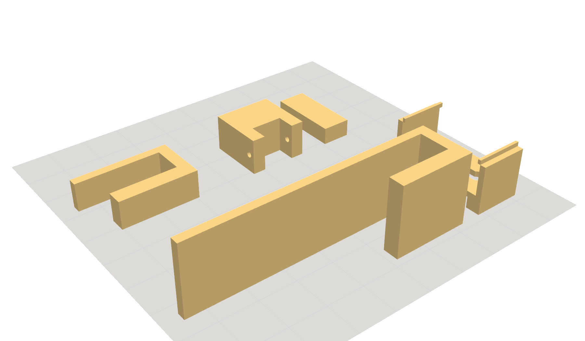

# VESTOR MOUNT — 3D PRINTING GUIDE

Everything you need to print the mount parts on the Hobby Shop's Bambu P2S / H2S.
Pre-oriented STLs are in `cad/out/print/` (regenerate: `cad/parts/print_orient.py`).
STEP files for Fusion 360 review are in `cad/out/*.step`. The parts are parametric —
to change any dimension, edit `cad/parts/mount_params.py` and re-run, don't edit STLs.



## Golden rule: print the COUPONS first

Do **not** batch-print 13 cleats until you've verified the fit against your *actual*
grooves (their width changes with paint/finish). First print just the two coupons:

| Coupon | File | Tests | ~Time / filament |
|---|---|---|---|
| **Tongue** | `00_coupon_tongue.stl` | the cleat tongue dropping into the **TOP** groove + saddle seating on the piece top | ~25 min · ~13 g |
| **Tab** | `02_foot_tab.stl` | the anti-swing tab sliding up into the **BOTTOM** groove | ~40 min · ~7 g |

**Check:** the tongue should drop in with a **slight** side-to-side wiggle (~0.5–1 mm total),
not force-fit and not sloppy; the saddle should sit flat on the piece top. The tab should
slide up smoothly and stay when pinched.
**Adjust:** if too tight/loose, change `TONGUE_Y0/TONGUE_Y1` (tongue width) or `TAB_W` in
`mount_params.py`, re-run `print_orient.py`, reprint the coupon. Only then batch the rest.

## Parts, orientation & quantities

| # | File | Qty | Orientation (as exported — keep it) | Supports | Notes |
|---|------|-----|--------------------------------------|----------|-------|
| 1 | `01_top_cleat.stl` | **13** | **on its side, 50 mm width UP** | none | the load-bearing part — orientation is critical (see below) |
| 2 | `02_foot_base.stl` | ~7 | channel + holes vertical | none | |
| 2 | `02_foot_tab.stl` | ~7 | 50 mm length flat on bed | none | also Coupon B |
| 5 | `05_corner_enclosure.stl` | 1 | backplate flat | **light** | supports only under the tongue/saddle overhang |
| 6 | `06_psu_cradle.stl` | 4 | base down | none | retaining nubs bridge fine |

Total ≈ **0.9 kg** of filament (free PLA). Everything fits **both** the P2S (256 mm) and
H2S (340 mm) beds. On the P2S you fit ~5 cleats per plate → ~3 plates for all 13; the H2S
fits more. The cleats are the bulk of the print time — run them on the **H2S** (faster) or
overnight.

### Why the cleat orientation matters (don't let the slicer auto-rotate it)
The cleat is printed with its cross-section flat on the bed and the 50 mm width pointing up.
Two reasons, both from the research: (1) the body is then a constant-section prism → **zero
supports**; (2) the ~1.5 kg hanging load runs **along** the layer lines, not across them —
a PLA hook printed this way holds **100+ kg** vs failing at ~15 kg the weak way. If Bambu
Studio's "auto orient" flips it upright, undo that.

## Bambu Studio settings

Quick-start: install Bambu Studio → pick your printer (P2S/H2S) and **Bambu PLA Basic** →
drag in the `cad/out/print/*.stl` → **turn OFF auto-orient** (they're already placed) →
apply the settings below → Slice → send to printer or export to SD.

| Setting | Value | Why |
|---|---|---|
| Nozzle / layer height | 0.4 mm / **0.2 mm** (0.28 "draft" fine for coupons) | strength + speed balance |
| **Wall loops** | **4** (5 for cleats) | walls carry the load in FDM — more walls beats more infill |
| **Infill** | **15–20 %** gyroid | load is 4–5× under the PLA creep limit, so light infill is plenty (saves time/filament) |
| Top/bottom layers | 4 / 4 | |
| Supports | **off**, except `05_corner_enclosure` (tree/normal, under the tongue only) | prisms need none |
| Brim | **5 mm** on the cleat + tab (tall/narrow footprints) | anti-tip / adhesion |
| Build-plate adhesion | textured PEI, 55 °C bed | standard PLA |
| Seam | back / aligned | cosmetic (parts are hidden anyway) |

**Material:** start in **free PLA** — it's genuinely fine here (validated 4–5× margin). If
you want zero long-term creep worry or a cleat sits near LED heat, reprint the **13 cleats**
in **PETG or ASA** on the H2S (65 °C chamber) later — same STL, just a hotter profile. The
feet/shoes/cradles can stay PLA forever.

## Hardware that goes into the prints (order alongside)
- **M4 heat-set inserts** (brass) — 2 per cleat rail-mount × 2 rails × 13 = **52**; press in
  with a soldering iron after printing. Plus **M4 bolts** (rail → cleat) and **M4 grub/jack
  screws** (leveling + saddle set-screw + tab pinch).
- **M2.5** screws + heat-set for the Pi in the corner enclosure.
- (Rails, steel, magnet feet: see `MANUFACTURING_PLAN.md` §7.)

## Regenerating / tweaking
```
cadenv/bin/python cad/parts/print_orient.py     # → cad/out/print/*.stl + print_layout.png
cadenv/bin/python cad/parts/assembly.py         # re-check the fit (collide_check) + renders
```
Change a dimension once in `cad/parts/mount_params.py`; every part + coupon + the assembly
move together. (Toolchain setup: `cad/README.md`.)

## Fusion 360 (optional)
Open any `cad/out/*.step` in Fusion to spin the part around or tweak it by hand. But since the
parts are parametric in `mount_params.py`, dimension changes are cleaner there (edit → re-export)
than redrawing in Fusion. Fusion is best for a visual review or a one-off manual mod.
